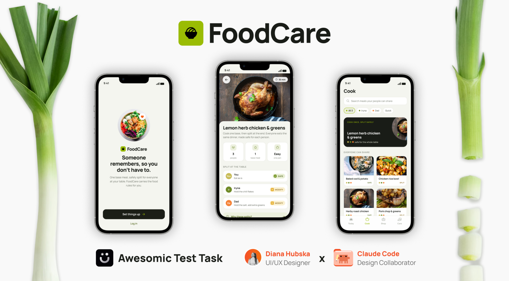
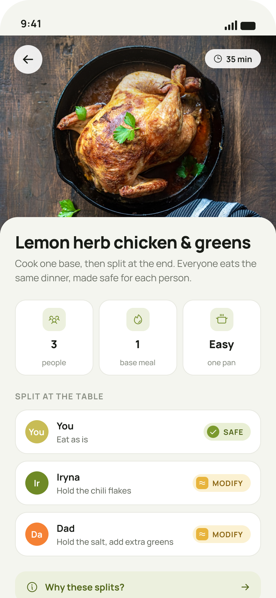
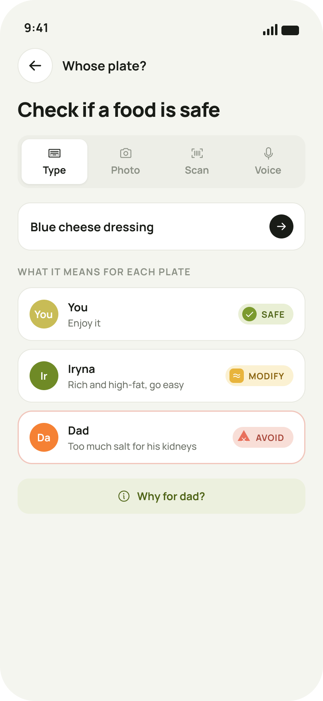
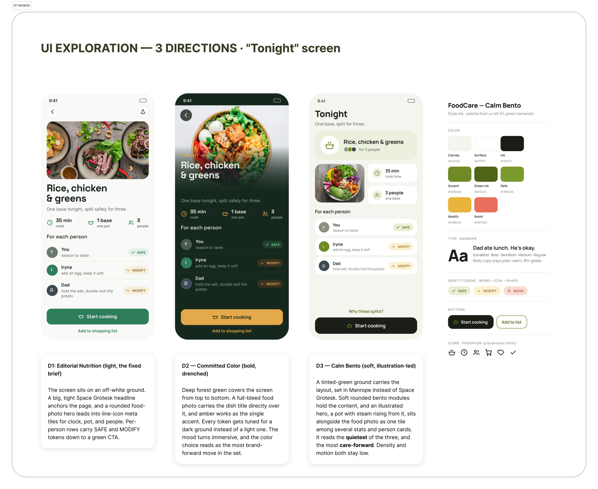

# FoodCare

**A recipe app for the person doing the caring.** Research, strategy, wireframes, 18 hi-fi screens, a design system, and a wired prototype.

### [→ Open the final prototype (Figma)](https://www.figma.com/proto/PxzpcPieRBfJ9GK0VIvB9o/UI-UX-Designer-Test-Task?node-id=65-1719&scaling=min-zoom&content-scaling=fixed&page-id=40%3A220&starting-point-node-id=65%3A1719)

All 18 screens, wired from Welcome through the daily loop to the carer hand-off. The earlier coded version is [still up here](https://dianature.github.io/foodcare-case-study/prototype/FoodCare.dc.html), and the two of them are the two prototyping stages described below.



---

## The brief asked for a recipe app for people 20 to 35, and the research said that was the wrong product

I did not want to design a general recipe app. General recipe apps sit in a crowded, low-trust category, and a brief that says "make a recipe app" hands you a format while leaving the problem unstated. So the first move was to find a specific person with a real reason to need the thing.

I asked 14 people the core questions and went deep with four of them. The numbers came back blunt. Only 2 of the 14 had ever used a dedicated recipe app, none used one currently, and every single person already got recipes from Instagram, TikTok, Google, ChatGPT, or simply from memory.

> "I am not going to dig through a hundred thousand apps." (P9)

That closed the generic brief. Recipes are free and everywhere, so a library answers a problem nobody in my sample had. I stopped looking at recipe discovery and went looking for the pain with no good answer.

I found two of them. People cook for more than one diet in the same kitchen, and people cook for someone who cannot give them feedback. One participant buys lactose-free food for his wife. Another cooks around her daughter's fish allergy and around vegetarian friends at the same table. The load falls on one person, and no single-user app helps them carry it.

That person is the caregiver, the one who does the cooking.

## The product truth

Everything after the research answers to one line.

> **Someone remembers, so you don't have to.**

The user is a caregiver in their late twenties or thirties, cooking for someone they care for, tired, and quietly worried. The stakes are medical, because a wrong plate can put someone in hospital. The tone still has to stay warm rather than clinical. That is the ownable position, between busy appetite-bait recipe apps and cold spreadsheet trackers.

One rule carried into every screen: **safety is shown by a word, an icon, and a shape together, never by colour alone.** A caregiver reading a screen in bad light, on an old phone, or with colour blindness gets the same answer as anyone else.

## The two screens that carry the product

| | |
|---|---|
|  | **Tonight.** Cook once, split safely. One base meal, then the exact per-person change, each carrying its own safety token. |
|  | **Whose plate.** Can this food go to this person, right now. A per-person verdict with a plain-language reason. |

Two product decisions came out of review, and both made the design more honest.

**Search is only one way in.** Whose plate takes a photo, a barcode scan, a pick from a meal the app already knows, or voice. A photo has to show what it thinks it saw before it gives a verdict, because a wrong guess is a safety verdict on the wrong food.

**The wrong-plate warning cannot be magic.** The app only knows a plate is headed to the wrong person when something tells it so. You are in that person's context, or you scanned a labelled container. So I reframed the guard as context-triggered rather than pretending the app watches your hands. A guard that fakes omniscience breaks trust the first time it gets something wrong.

## Process

| Stage | Output |
|---|---|
| Niche and competitor mapping | Seven survivable directions from a field of many. [Strategy](docs/02-niche-and-strategy.md) |
| Primary research | 14 people, 3 recorded interviews, 1 chat survey. [Research summary](docs/00-research-summary.md) |
| Wireframes | ~21 low-fi phone screens, green-only and titles-only on purpose. [Plan](docs/04-wireframes-plan.md) |
| Visual direction | Three hi-fi directions built on the same screen. Calm Bento won. [Study](docs/05-visual-direction.md) |
| System spec | Tokens, type scale, icons, components, accessibility. [Spec](docs/06-ui-design-spec.md) |
| Prototype, stage 1 | The spec built as real HTML, CSS and JS, to test whether it held up. [Live](https://dianature.github.io/foodcare-case-study/prototype/FoodCare.dc.html) |
| Prototype, stage 2 | 18 screens plus the design system in Figma, wired and reachability-checked. [Live](https://www.figma.com/proto/PxzpcPieRBfJ9GK0VIvB9o/UI-UX-Designer-Test-Task?node-id=65-1719&scaling=min-zoom&content-scaling=fixed&page-id=40%3A220&starting-point-node-id=65%3A1719) · [Process](docs/01-design-process.md) |

### Choosing the look

I treated the hi-fi direction as its own study instead of inheriting the wireframe skin. Three directions were built at full fidelity on the same screen (Tonight): **Editorial Nutrition**, light and grotesk-led; **Committed Color**, a drenched deep-green screen with an amber accent; and **Calm Bento**, soft, humanist, and the quietest of the three.

Calm Bento won, because a caregiver who is already tired does not need a loud interface on top of a hard day.



Running the direction as a study also caught two AI defaults before they reached the file: a cream-and-terracotta palette, and a Fraunces serif. Both are what generative tools reach for by default, and both would have made the product look like every other AI-designed app.

## The prototype, in two stages

I prototyped this twice, on purpose, and the two versions did different jobs.

### Stage 1: the coded prototype (Claude Design)

**[Open it](https://dianature.github.io/foodcare-case-study/prototype/FoodCare.dc.html)** · source in [`prototype/`](prototype/)

Once the UI spec existed, I built the screens as real HTML, CSS and JS through Claude Design, before opening Figma. Working in code first put pressure on the spec in a way a static mockup never does. A token either exists or it does not. A component either takes the state you claimed it takes, or the markup breaks. Several gaps in the safety-token system only became obvious once I had to write them out.

This version is the earlier one. I am keeping it up because it is honest about the order I worked in, and because it is the artefact that proves the design system was real rather than decorative.

### Stage 2: the final prototype (Figma)

**[Open it](https://www.figma.com/proto/PxzpcPieRBfJ9GK0VIvB9o/UI-UX-Designer-Test-Task?node-id=65-1719&scaling=min-zoom&content-scaling=fixed&page-id=40%3A220&starting-point-node-id=65%3A1719)**

The finished product lives in Figma: 18 screens plus the design system, wired together from the first screen through to the last. Onboarding runs into the app, the four-tab bar carries Today, Cook, Shop and Care, the "Why this rule" sheet floats over a dimmed Tonight, and the hand-off moves from the family app into the carer's.

After wiring I ran a reachability pass over every link. It caught a tab bar that went nowhere, a screen nothing pointed to, and a back button aimed at the wrong step. All 18 screens are now reachable from Welcome with no orphans.

The Figma file is also where the polish landed: the warmed palette, real food photography on the recipe surfaces, and people shown as coloured initials so nobody is reduced to a photograph of a sick relative.

## What I have not done

I have not tested any of this with real users, and I would rather say that plainly than gloss over it. Every decision here is grounded in the ideation map, the competitor check, and the household interviews. Grounded is not the same as validated.

Usability testing is the next step. Specifically on the wrong-plate guard, to see whether the context trigger reads as trustworthy rather than confusing, and on the tone across the app, to check that it lands as warm for someone who is tired and worried in the moment they open it.

## Repository

```
docs/        research, strategy, wireframe plan, visual study, UI spec, time log
visuals/     research visualisations, wireframes, 18 hi-fi screens
prototype/   HTML / CSS / JS handoff bundle
```

## A note on the research data

The people I interviewed are friends and acquaintances who spoke to me about their households and their health. Raw recordings, transcripts, and chat screenshots stay private. Everything in this repository is pseudonymised, and I removed the details that would identify anyone.

Personas (Iryna, Eduard, Natalia, Olena) are composite characters built to hold the findings. They are not real participants.

---

Designed and built by [Diana Hubska](https://github.com/dianature). It started as a test task, and I took it further than the brief asked for.
